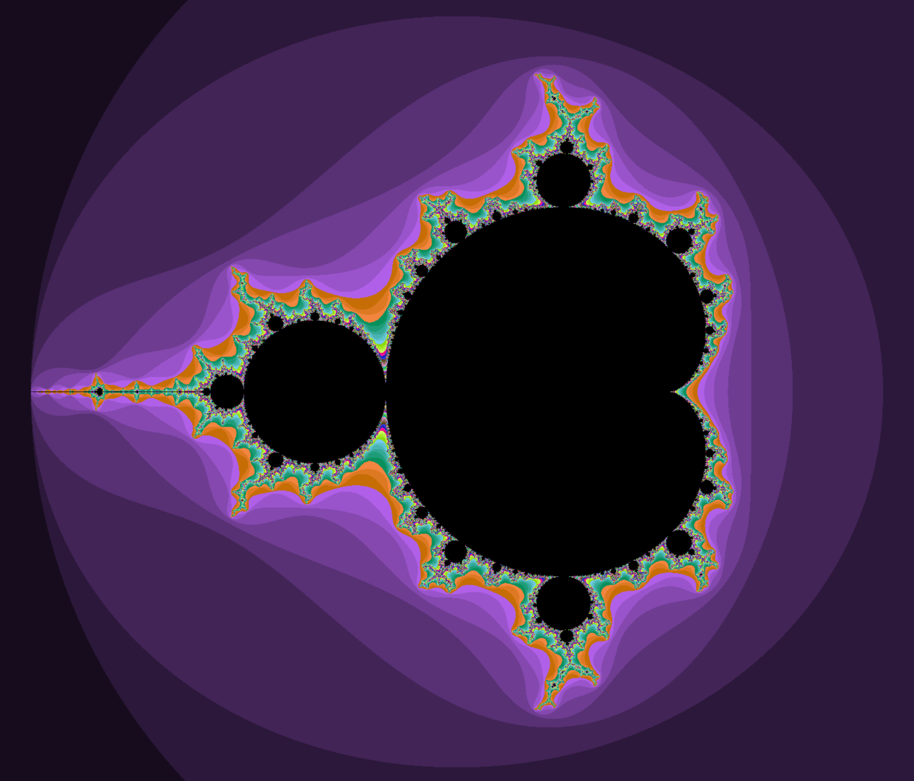
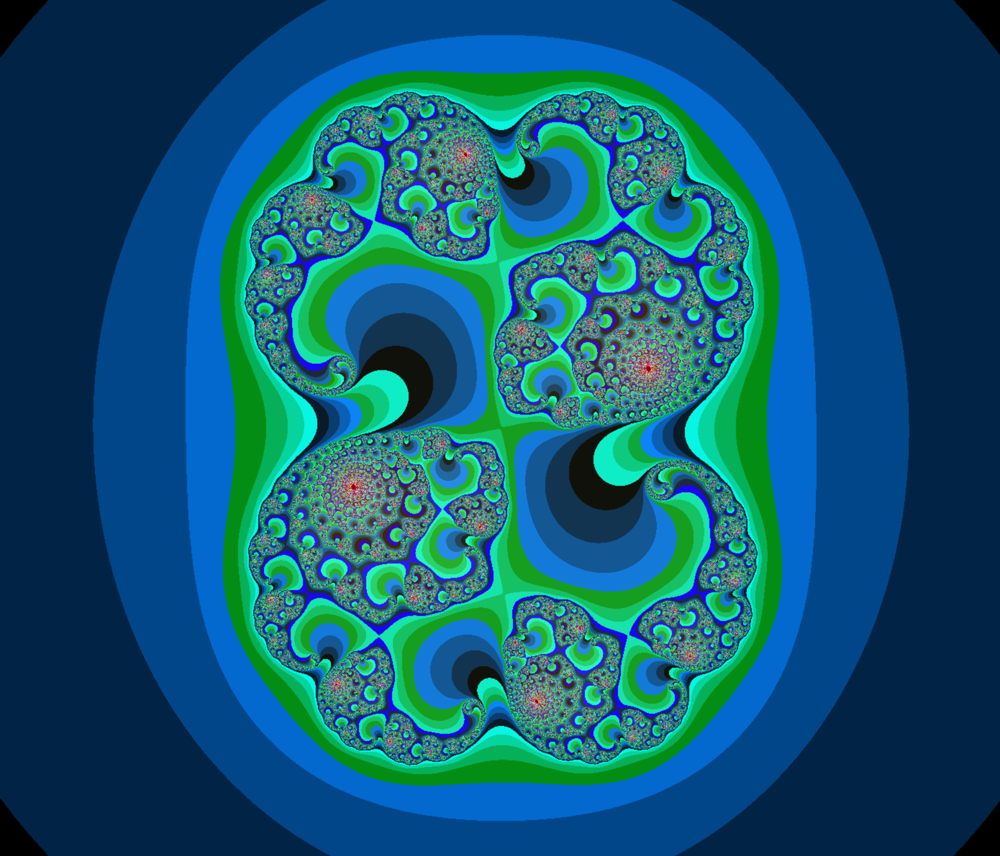
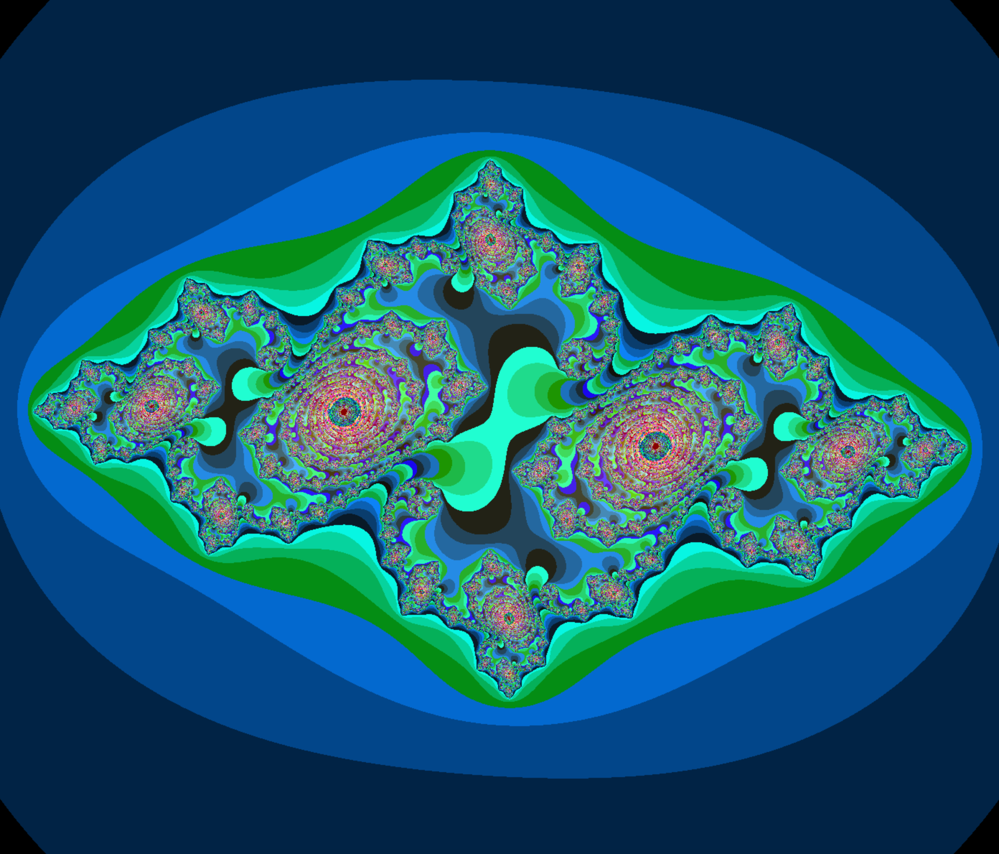
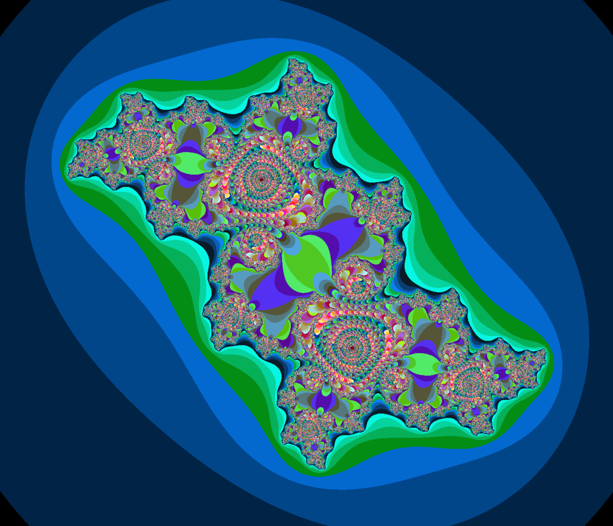
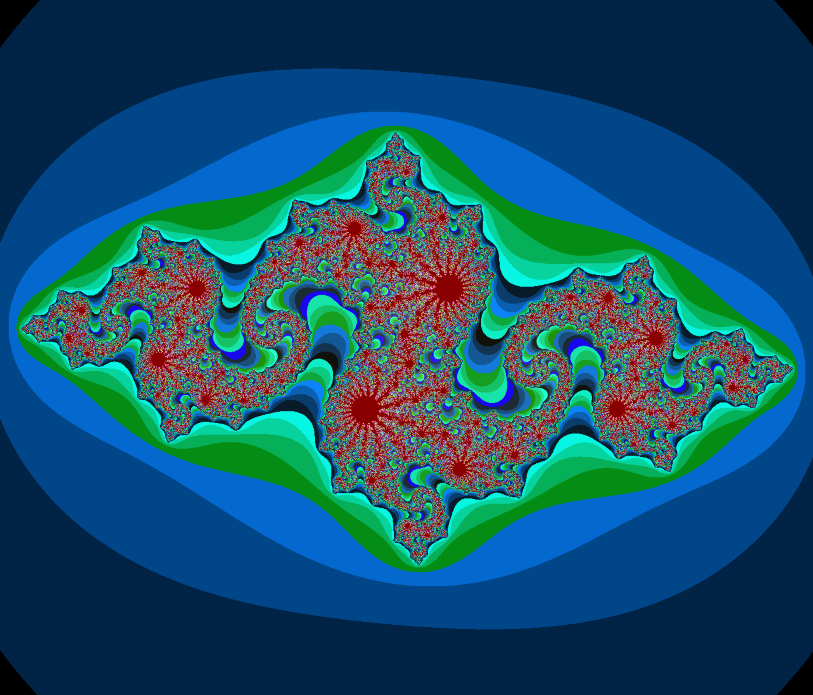
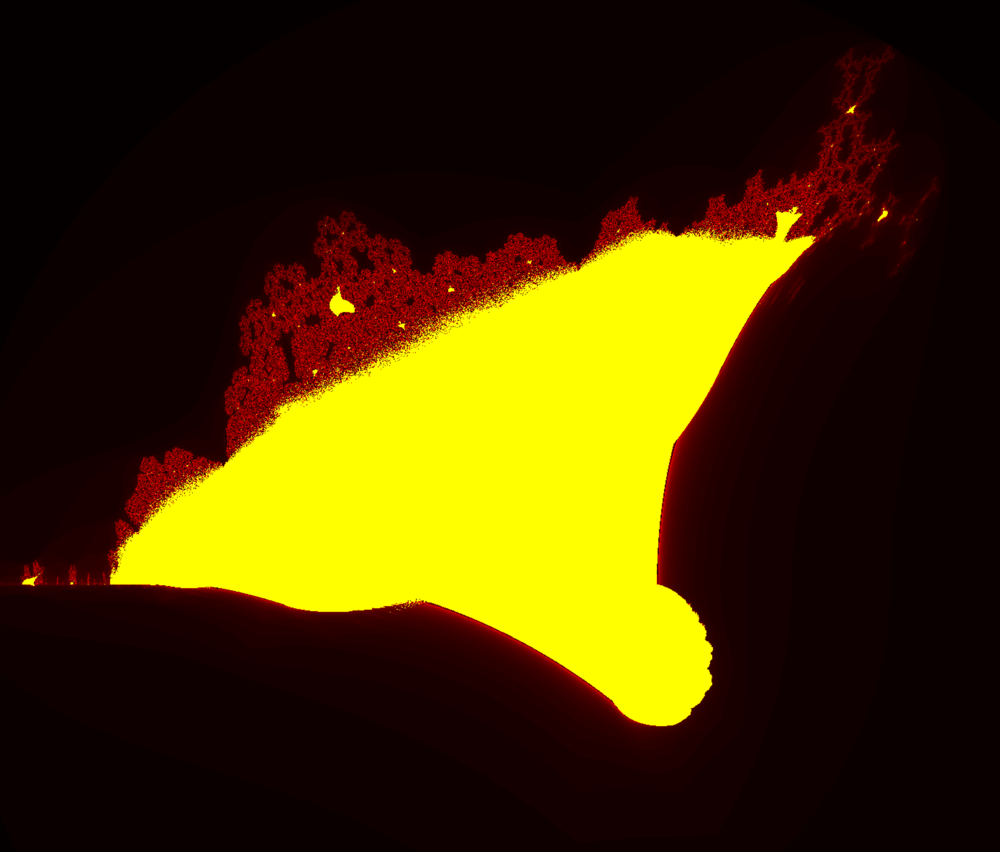
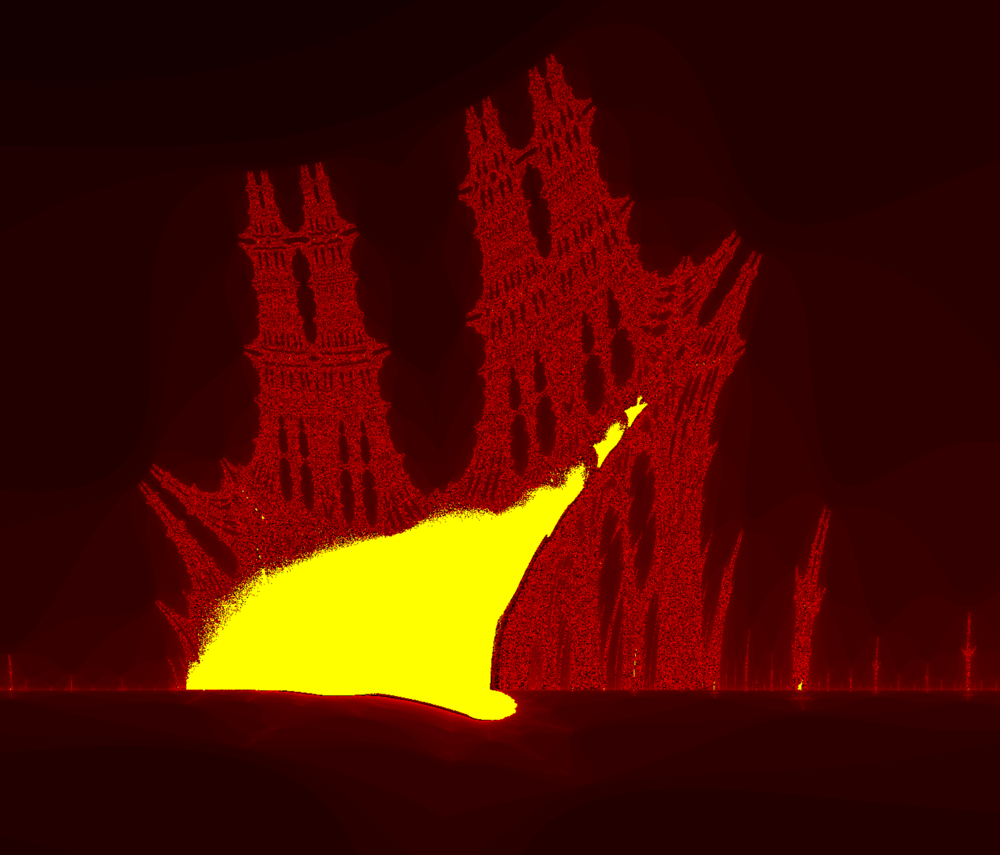
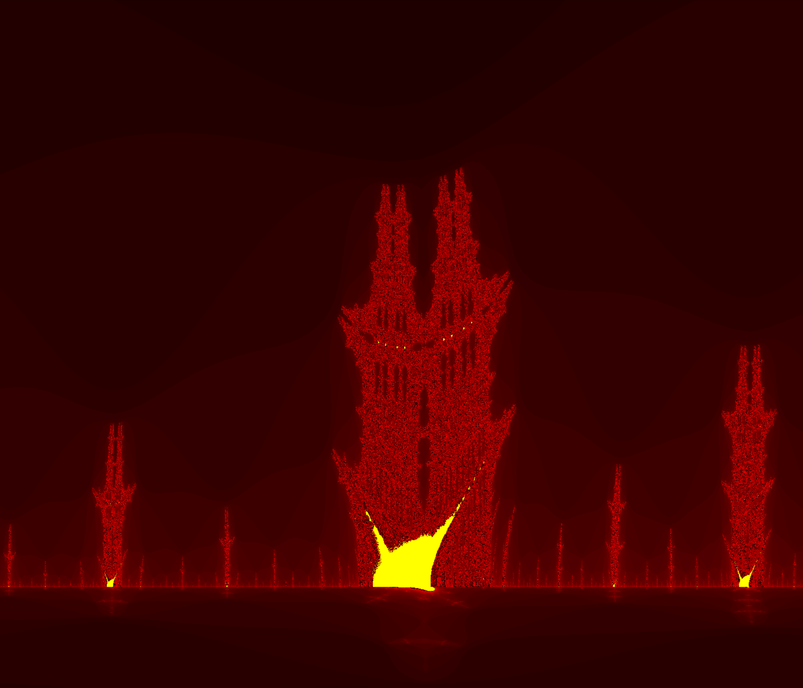

# ⚠️ WARNING ⚠️
Please refrain from using my Makefile as a reference since it needs to be revised.

# 42 - FRACT'OL PROJECT

### Introduction
A fractal is an abstact mathematical object, like a curve or a surface, which has a similar pattern whatever the scale. This new project will be the opportunity for you to hone your miniLibX skills, to make you discover/use the mathematical notion of complex numbers and to take a peek at the concept of optimization in computer graphics.

## Mandatory Part
This project’s goal is to create a small fractal exploration program.
\
\
The constraints are as follows:
* Your software should offer the Julia set and the Mandelbrot set
* The mouse wheel zooms in and out, almost infinitely (within the limits of the computer). This is the very principle of fractals
* You must use at least a few colors to show the depth of each fractal. It’s even better if you hack away on psychedelic effects
* A parameter is passed on the command line to define what type of fractal will be viewed. If no parameter is provided, or if the parameter is invalid, the program displays a list of available parameters and exits properly
* More parameters must be used for fractal parameters or ignored
* You must be able to create different Julia set with the parameters of the program

As for the graphic representation:
* ESC will exit the program
* The use of images of the minilibX is strongly recommended

### Technical Considerations
* You cannot use global variables
* You must code in C
* You have to handle errors carefully. In no way can your program quit unexpectedly (segmentation fault, bus error, double free, etc)
* Your program cannot have memory leaks
* You must use the miniLibX. Either in the version that is available on the system, or from its sources. If you choose to work with the sources, you will need to apply the same rules for your libft as those written above

## Bonus Part
* One more different fractal (there are more than a hundred different types of fractals referenced online)
* The zoom follows the actual mouse position
* In addition to the zoom: moving with the arrows
* Make the color range shift

## Output
### Mandelbrot Fractal

### Julia Fractal

  Julia Set: 0.2850 + 0.0100i

  Julia Set: 0.7500 + 0.1100i

  Julia Set: -0.1000 + 0.6510i

  Julia Set: -0.8000 + 0.1560i

  Julia Set: -0.7269 + 0.1889i

### Burning Ship Fractal

